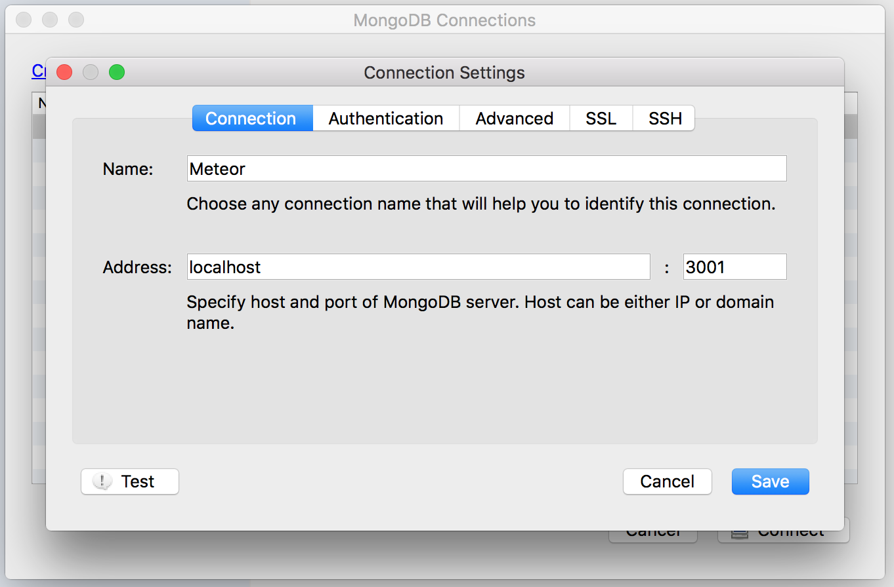
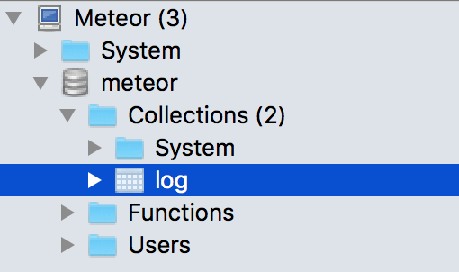

# Meteor react-redux ready to use
For rapid prototyping with a complete react-redux environment

## what inside
Tech:
* backend: meteor + express + streamy
* frontend: react + redux + sagas
* templating: material-ui + flexibox

Demo:
* rest-api demo with express
* web socket with streamy
* pure react component
* sagas interaction
* database interaction
* ...

to remove the demo file:
* 
*

## How to use it
### Get the boilerplate
* fork the project
* git clone

### Install the dependencies
```
cd project-folder
meteor npm install
```

### Launch the server
```
meteor
```
Then in browser:
```
http://localhost:3000
```
### Launch the database
Meteor use Mongo as DB
Open a new terminal with your server running
In this boilerplate by default a 'log' collection is created
```
meteor mongo
db.log.find()
```
With [Robomongo](https://robomongo.org/) create a new connection



then



## THEN

(•_•)...( •_•)>⌐■-■...(⌐■_■) be cool...
