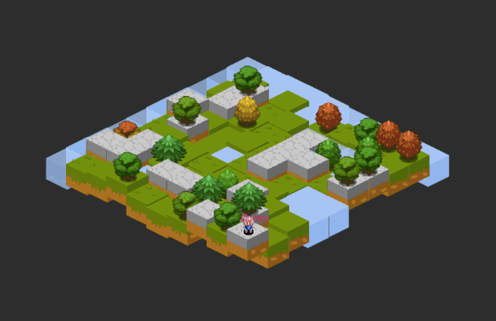
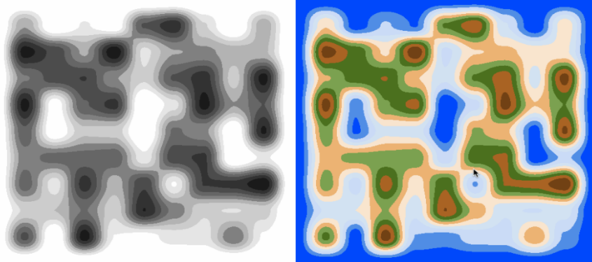
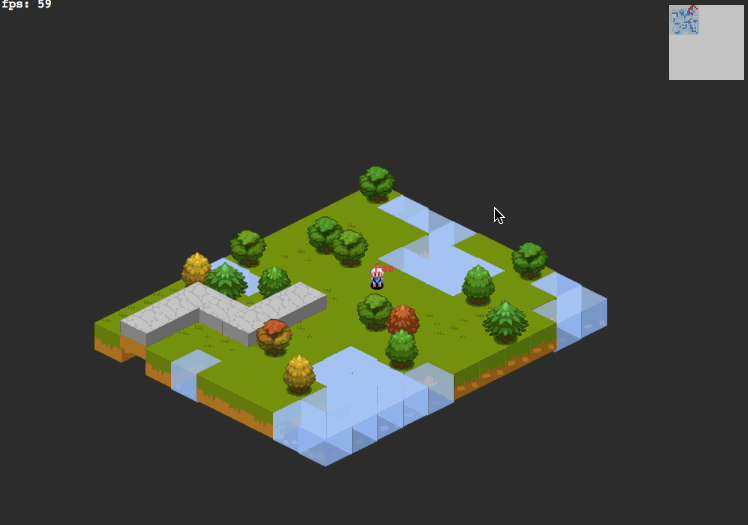

# Iso.io
## The connected isometric game boilerplate !
Iso.io is a boilerplate for multi-players isometric game build with Phaser, inspired by [multipixel-game](https://github.com/ClemDelp/multipixel-game)

It was build to be simple to understand, easy to update/ transform/adapt and easy to deploy



## Live Demos

https://iso-io.herokuapp.com/

## Installation

Meteor 1.3.3 are required
Clone the project then:

```
cd ios.io
sh install.sh
```

Then go to http://locahost:3000

## Techno

- [Meteor]() for the server side because... everything is so simple with meteor ;-)
- [React]() & [Redux]() combo for the frontend
- [Phaser.js]() for the game engine itself

[react-redux-meteor-boilerplate](https://github.com/ClemDelp/react-redux-meteor-boilerplate) was used to generate the very basic structure (boilerplate inception!)

## Procedural Map Generation

[heightmap-generator](https://github.com/ClemDelp/heightmap-generator) is used to generate the map



## Perfomrance for large rendering
### Smart layer



## Architecture

## Configuration


(•_•)...( •_•)>⌐■-■...(⌐■_■) be cool...
